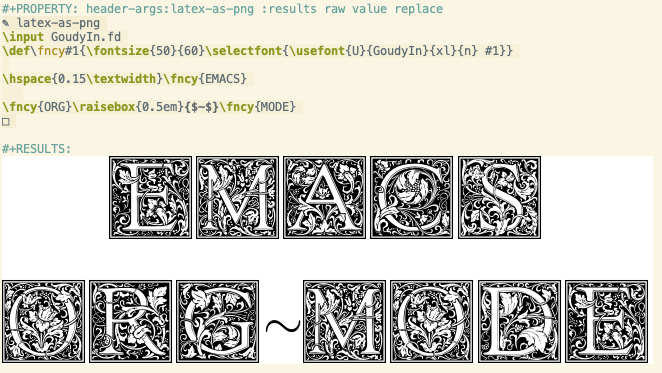
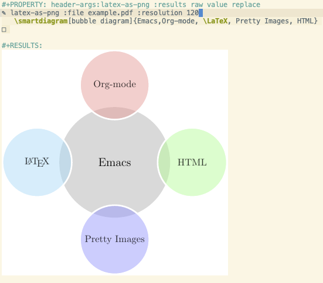
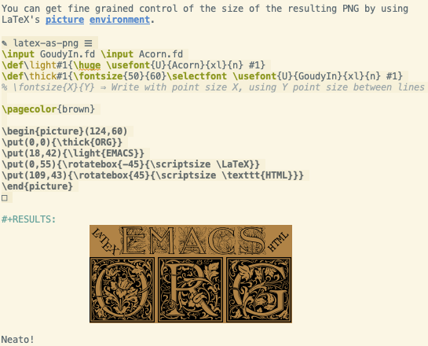
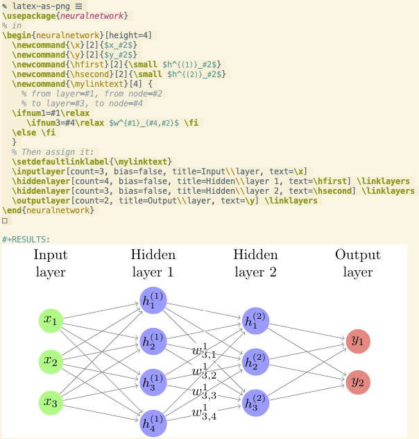

> An Org-babel “language” whose execution produces PNGs from LaTeX snippets;
> useful for shipping **arbitrary** LaTeX results in HTML or to **inline** such snippets
> in Emacs! (•̀ᴗ•́)و

    ;; Installation
    (use-package ob-latex-as-png
      :ensure t)

# Table of Contents

1.  [Screenshot 1: Fancy Writing](#Screenshot-1-Fancy-Writing)
2.  [Screenshot 2: Bubble Diagrams](#Screenshot-2-Bubble-Diagrams)
3.  [Screenshot 3: Fine-grained Size Control](#Screenshot-3-Fine-grained-Size-Control)
4.  [Screenshot 4: *Local* LaTeX Header Matter](#Screenshot-4-Local-LaTeX-Header-Matter)
5.  [Hint: Always redisplay images after `C-c C-c`](#Hint-Always-redisplay-images-after-C-c-C-c)
6.  [Enjoy!](#Enjoy)

# Screenshot 1: Fancy Writing

 
:rose: Click to see Source!

    #+PROPERTY: header-args:latex-as-png :results raw value replace
    #+begin_src latex-as-png
    \input GoudyIn.fd
    \def\fncy#1{\fontsize{50}{60}\selectfont{\usefont{U}{GoudyIn}{xl}{n} #1}}

    \hspace{0.15\textwidth}\fncy{EMACS}
    \newline
    \fncy{ORG}\raisebox{0.5em}{$\sim$}\fncy{MODE}
    #+end_src

Note: The [Goudy Initalen](https://www.tug.org/FontCatalogue/goudyinitialen/) font exists in uppercase only.

# Screenshot 2: Bubble Diagrams

 
:rocket: Click to see Source!

    #+PROPERTY: header-args:latex-as-png :results raw value replace
    #+begin_src latex-as-png :file example.pdf :resolution 120
       \smartdiagram[bubble diagram]{Emacs,Org-mode, \LaTeX, Pretty Images, HTML}
    #+end_src

Note: The extension given to `:file` does not matter, only the base name is used
and a `.png` is produced.

# Screenshot 3: Fine-grained Size Control

You can get fine grained control of the size of the resulting PNG by using
LaTeX's [picture](https://en.wikibooks.org/wiki/LaTeX/Picture) [environment](https://www.overleaf.com/learn/latex/picture_environment).

 
🌱 Click to see Source! 🗝 

    #+begin_src latex-as-png :file using-picture-environment
    \input GoudyIn.fd \input Acorn.fd
    \def\light#1{\huge \usefont{U}{Acorn}{xl}{n} #1}
    \def\thick#1{\fontsize{50}{60}\selectfont \usefont{U}{GoudyIn}{xl}{n} #1}
    % \fontsize{X}{Y} ⇒ Write with point size X, using Y point size between lines

    \pagecolor{brown}

    \begin{picture}(124,60)
    \put(0,0){\thick{ORG}}
    \put(18,42){\light{EMACS}}
    \put(0,55){\rotatebox{-45}{\scriptsize \LaTeX}}
    \put(109,43){\rotatebox{45}{\scriptsize \texttt{HTML}}}
    \end{picture}
    #+end_src

# Screenshot 4: *Local* LaTeX Header Matter

You can get fine grained control of the size of the resulting PNG by using
LaTeX's [picture](https://en.wikibooks.org/wiki/LaTeX/Picture) [environment](https://www.overleaf.com/learn/latex/picture_environment).

You can add arbitrary LaTeX header matter &#x2014;i.e., the stuff before LaTeX's
`\begin{document}`&#x2014; by using having a line with just “ `% in` ” to separate the
header from the main PNG body.

 
🐺 Customisation and Global Headers 🗝 

    (defvar ob-latex-as-png-header '("\\usepackage{smartdiagram}")
      "The LaTeX preamble used for executing latex-as-png source blocks.

    This is generally any LaTeX matter that may appear before \\begin{document}.")

    (defvar ob-latex-as-png-header-separator "% in"
      "A literal expression that separates local LaTeX header matter from the body.

    Everything before the separator is matter that is necessary
    to produce a PNG from the primary LaTeX.")

 
🌱 Click to see Source! 🗝 

    #+begin_src latex-as-png :results replace :file neural-networks
    \usepackage{neuralnetwork}
    % in
    \begin{neuralnetwork}[height=4]
      \newcommand{\x}[2]{$x_#2$}
      \newcommand{\y}[2]{$y_#2$}
      \newcommand{\hfirst}[2]{\small $h^{(1)}_#2$}
      \newcommand{\hsecond}[2]{\small $h^{(2)}_#2$}
      \newcommand{\mylinktext}[4] {
        % from layer=#1, from node=#2
        % to layer=#3, to node=#4
      \ifnum1=#1\relax
         \ifnum3=#4\relax $w^{#1}_{#4,#2}$ \fi
      \else \fi
      }
      % Then assign it:
      \setdefaultlinklabel{\mylinktext}
      \inputlayer[count=3, bias=false, title=Input\\layer, text=\x]
      \hiddenlayer[count=4, bias=false, title=Hidden\\layer 1, text=\hfirst] \linklayers
      \hiddenlayer[count=3, bias=false, title=Hidden\\layer 2, text=\hsecond] \linklayers
      \outputlayer[count=2, title=Output\\layer, text=\y] \linklayers
    \end{neuralnetwork}
    #+end_src

( Learn more about the neural networks LaTeX library [here](https://github.com/battlesnake/neural). )

# Hint: Always redisplay images after `C-c C-c`

Place the following incantation in your init (•̀ᴗ•́)و)

    ;; Always redisplay images after C-c C-c (org-ctrl-c-ctrl-c)
    (add-hook 'org-babel-after-execute-hook 'org-redisplay-inline-images)

# Enjoy!

